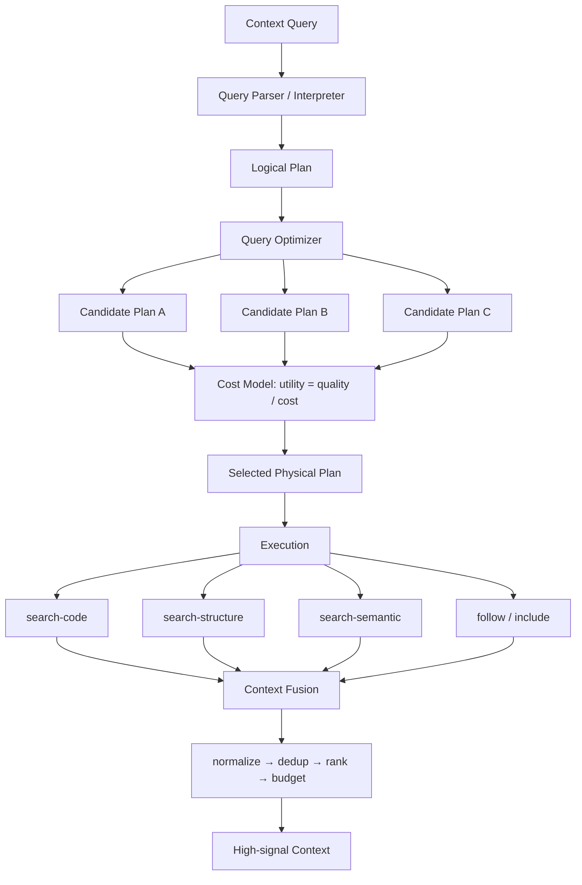
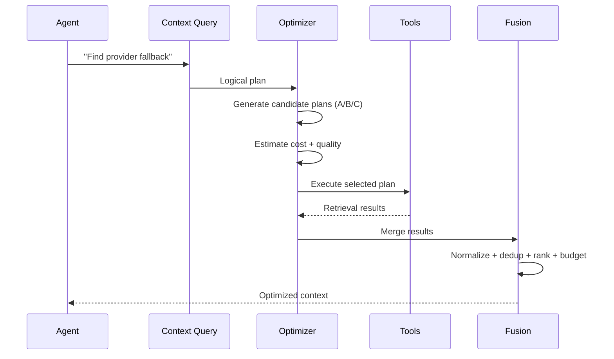

# context-query-engine

> A cost-aware query engine for retrieving high-signal context from large codebases for AI agents.

**context-query-engine** treats agent context retrieval as a **query optimization problem**.

Instead of asking an agent to decide which files to grep, which tools to call, and how much context to read, the agent describes **what it needs**. The engine builds a logical query, selects a physical retrieval plan, executes the appropriate tools, and assembles the most useful context within a target budget.

```text
Agent
  │
  │ "Find the implementation of provider fallback,
  │  follow references, include tests"
  ▼
Context Query
  │
  ▼
Logical Plan
  │
  ▼
Query Optimizer
  │
  ├── search-code
  ├── search-structure
  ├── search-semantic
  ├── project-map
  └── extract-context
  │
  ▼
Context Fusion
  │
  ├── normalize
  ├── deduplicate
  ├── rank
  └── budget
  │
  ▼
High-signal Context
  │
  ▼
LLM Agent
```

---

## Why?

Large codebases make naive context retrieval expensive and noisy.

A typical agent may repeatedly:

* grep the entire repository;
* read complete files after finding a match;
* call multiple overlapping tools;
* retrieve duplicate results;
* spend tokens on irrelevant files;
* use the same retrieval strategy for very different query types.

The problem is not simply **retrieval**.

It is deciding:

> **What information should be retrieved, which operations should retrieve it, in what order, and when should retrieval stop?**

context-query-engine applies the database query optimizer model to this problem.

| Database systems | context-query-engine |
| ---------------- | -------------------- |
| SQL | Context Query |
| Query parser | CQP parser + interpreter |
| Logical plan | Retrieval requirements |
| Query optimizer | Physical plan selection |
| Cost model | Tokens + latency + tool calls |
| Query operators | Search / structure / semantic / extraction |
| Query execution | Ordered retrieval |
| Result set | Fused context |
| Query statistics | Execution telemetry |

The agent describes **what it needs**. The engine decides **how to obtain it**.

---

## Current status

> **Early-stage / research-oriented implementation.**

The project already implements a working retrieval pipeline with:

* declarative Context Query syntax;
* intent interpretation (heuristic + optional local ML classifier);
* logical and physical plans;
* candidate physical plans per query type;
* cost-aware plan selection (`utility = quality / cost`);
* cardinality estimation, refined with post-execution actuals;
* execution telemetry and adaptive statistics;
* early termination;
* cross-tool deduplication and relevance ranking;
* context-budget management;
* optional reranking;
* intra-session caching;
* MCP integration.

The current implementation should be understood as a **cost-aware retrieval planner / tool router evolving toward a full query optimizer**.

Some research components have been validated, while others have been rejected or remain inconclusive (OOD cost models, learned plan steering, EU-based selection). The repository intentionally preserves that evidence rather than presenting every experiment as a success. See [Research and experiments](#research-and-experiments).

---

## Core idea: context retrieval as query optimization

### Context Query

A declarative description of the information the agent needs.

```text
FIND implementation OF concept "provider fallback"
AND FOLLOW references
AND INCLUDE tests
LIMIT 8000
```

### Logical plan

Describes **what must be retrieved**, without committing to specific tools.

```text
target: concept("provider fallback")
relation: references
include: tests
budget: 8000
```

### Physical plan

Describes **how the query will actually be executed**.

```text
search-code(definitions)
→ search-code(implementation)
→ search-structure(implementation)
→ follow(references)
→ include(tests)
```

### Cost model

Candidate plans are evaluated using execution cost and expected quality.

```text
cost = w1 · tokens + w2 · latency + w3 · tool_calls
utility = quality / cost
```

Weights are configurable through environment variables (`CF_COST_1..3`, `CF_QUALITY_1..3`).

### Context fusion

Results from different retrieval operators are normalized, filtered, deduplicated, ranked and assembled into the final context.

---

## How it works



### Execution phases

1. **Interpretation** — the query is parsed and classified into an intent (`query_type` + confidence).
2. **Planning** — the engine creates a logical representation of the retrieval requirements.
3. **Optimization** — candidate physical plans are evaluated using the cost model and accumulated statistics.
4. **Execution** — operators run in the selected order; early termination skips operations once the query is satisfied.
5. **Fusion** — results are normalized, deduplicated and ranked.
6. **Budgeting** — the engine attempts to keep the resulting context within the requested context level (soft cap, see [Limitations](#limitations)).
7. **Telemetry** — actual execution statistics are recorded and refine future estimates.



---

## Quick start

### Requirements

* Node.js ≥ 18
* `ripgrep`
* `fd`
* `jq`

Optional: `ast-grep`, `probe`, `tokei`, `semgrep`.

The engine itself has **zero npm runtime dependencies**.

### Install

```bash
git clone https://github.com/khnker/context-query-engine.git
cd context-query-engine
npm run check-tools
```

### Run a query

```bash
node engine/engine.js 'FIND definitions OF symbol parseConfig'
```

Or use natural language:

```bash
node engine/engine.js --intent 'where is parseConfig defined?'
```

---

## CQP

The Context Query language is intentionally declarative.

```text
FIND implementation OF concept "provider fallback"
AND FOLLOW references
AND INCLUDE tests
LIMIT 8000
```

The terminology deliberately distinguishes:

```text
Context Query (CQ)      → the agent's request text
Context Query Plan (CQP) → structured logical representation produced by parseCQP
Physical Retrieval Plan  → optimizer output (ordered ops)
```

The project does not use `CQL` for the query language because that name collides with existing standards.

---

## MCP

context-query-engine exposes a deliberately small MCP surface for agents.

* `context_query({intent, constraints})` — main abstraction
* `search_files` / `read_file` — low-level escape hatches

```text
Agent → context_query() → Query optimization → Context
```

---

## Retrieval operators

The engine can compose multiple retrieval strategies:

| Operator | Purpose |
| -------- | ------- |
| `search-code` | Text/code search (rg) |
| `search-structure` | Structural / AST search (ast-grep) |
| `search-semantic` | Semantic retrieval (Probe) |
| `project-map` | Repository structure and statistics |
| `extract-context` | Extract relevant source spans |
| `bm25` | In-repo BM25 index (opt-in, hybrid fusion) |
| `follow` | Follow references |
| `include` | Include related artifacts such as tests |

The optimizer decides which operators are useful for a particular query.

---

## Context budgets

The system supports predefined context levels:

```text
2000   8000   20000   30000
```

Intermediate values map to the closest level (`5000 → 2000`). Override with `CF_BUDGET`.

> **Important:** the current budget mechanism is a **soft cap**, not a strict hard limit. Broad retrieval queries can exceed the requested budget when preserving minimum context for matched paths (e.g. a 1.76M-token broad `pm2` query against a 30k budget). This is measured and tracked by the evaluation suite; strict-budget mode is available as default since adversarial mitigations (M3).

---

## Benchmarks & evidence

The project is evaluated against naive retrieval baselines on: context tokens, correctness, information density, precision, recall, latency, optimizer regret, MRR, and execution cost.

### Harness T1 — 32 synthetic tasks, 4 modes

| Mode | Correctness | Tokens | Latency | Compression vs A |
|------|-------------|--------|---------|------------------|
| A — raw baseline (`grep`/`cat`) | 100% | 139,199 | 978 ms | 1.0× |
| B — `rg`/`fd` | 92.5% | 95 | 108 ms | 637× |
| **C — context-query-engine** | **100%** | **764** | **199 ms** | **104×** |
| D — oracle | 87.5% | 611 | 1,506 ms | 129× |

### Real repo T2 — `polar` (2,129 files, 50k+ LOC)

| Mode | Correctness | Tokens | Latency | Density |
|------|-------------|--------|---------|---------|
| A — baseline | 8/8 | 694,581 | 12,098 ms | 0.1856 |
| **C — context-query-engine** | **8/8** | **3,403** | **232 ms** | **0.1875** |

C cuts **204× vs baseline** on the real repo with 98% less latency, keeping correctness and the highest density.

### Real-world evidence — heavy tree (`/home/nicolas/dev`, ~24 GB / 164k files)

| Query | Naive retrieval | Engine | Reduction |
| ----- | --------------: | -----: | --------: |
| Broad `pm2` query | 33.5M tokens | 1.76M | ~19× |
| Precise `SERVICE_META` query | 4,056 tokens | 104 | ~39× |

The same measurements show an important trade-off:

> Raw grep is faster for small, precise cold queries. The engine pays off on broad-concept queries over large trees (ranking + budget + cache included).

### Reproducibility

```bash
./evals/reproduce.sh T1          # in-repo fixtures (32 queries)
./evals/reproduce.sh T2          # polar, TEST split (8 queries)
./evals/reproduce.sh dev         # dev workspace tree (14 queries, real ground truth)
./evals/reproduce.sh T1 --smoke  # fast CI: 2 queries, runs=1
```

Each run produces a versioned artifact set: `manifest.json`, `environment.json`, `queries.jsonl`, `raw-results.jsonl`, `metrics.json`, `statistical-tests.json` (paired bootstrap, 95% CI), and `report.md` with PASS/FAIL.

The benchmark does **not** treat lower token usage as sufficient evidence; results are evaluated jointly on correctness, context cost, latency, information density, and optimizer regret.

---

## Limitations

This project is intentionally experimental. Known limitations include:

* the context budget is a **soft cap** — broad retrieval can exceed it;
* raw `rg` is 6–10× faster on small, precise cold queries (exact filename/symbol in small repos);
* semantic retrieval depends on optional tooling (`probe`);
* cost estimates require sufficient telemetry (≥3 records per `(operator, predicate_class)`);
* repository-specific distributions break ML cost models OOD — the heuristic remains the robust default;
* several learned approaches (EU selection, plan steering, calibrated cardinality) were rejected or remain at parity: pre-execution signals do not discriminate, and calibration does not transfer across repos;
* the project is stdlib-only; dense embedding retrieval is out of scope.

See [Research and experiments](#research-and-experiments) and `docs/evidence/` for the detailed record.

---

## Repository structure

```text
context-query-engine/
├── agent-context-engineering/   # Agent skill and retrieval policies
│   ├── SKILL.md
│   ├── references/
│   └── config/
├── engine/                      # Core query engine (Node ESM, stdlib-only)
│   ├── cqp.js                   # Query parser
│   ├── interpreter.js           # Intent classification
│   ├── optimizer.js             # Cost model + plan selection
│   ├── engine.js                # Execution pipeline
│   ├── evidence.js              # Evidence packet standard (Score<T>)
│   ├── selector.js              # Budgeted context selection (marginal/MMR)
│   ├── soundex.js               # Phonetic fallback
│   └── mcp-server.js            # MCP interface
├── scripts/                     # Retrieval and diagnostic CLIs
├── evals/                       # Benchmarks, datasets, reports
│   ├── datasets/                # tasks, adversarial, no-gold, soundex...
│   ├── scripts/                 # per-experiment eval scripts
│   ├── reports/                 # artifacts (evals/reports/<change>-<TS>.json)
│   └── reproduce.sh
├── docs/                        # Research and technical documentation
│   ├── THESIS.md                # CQE thesis: adaptive evidence acquisition
│   ├── experiments.md           # Full experiment index
│   └── evidence/                # Per-experiment evidence (46 files)
├── openspec/                    # Spec-driven governance (local)
├── EVIDENCIA-DEV-TREE.md        # Real-world evidence
├── MASTER-PLAN-v17.md           # Development plan
└── package.json
```

---

## Testing

```bash
npm test                 # unit + smoke + e2e (TMPDIR=$PWD/.tmp npm test → 50/50)
npm run bench            # hard token/latency guards (C vs A)
npm run check-tools      # toolchain verification
engine/mcp-test.sh       # MCP init → tools/list → context_query
```

---

## Research and experiments

The full experimental record lives outside this README:

* **[docs/experiments.md](docs/experiments.md)** — index of 46 experiments, one line each, with verdict (✅ PASS / ⚠️ PARITY / ❌ REJECT) and link to the full evidence.
* **[docs/evidence/](docs/evidence/)** — per-experiment evidence files: methodology, metrics, verdict, artifacts.
* **[docs/THESIS.md](docs/THESIS.md)** — the CQE thesis framing the system as adaptive evidence acquisition under uncertainty and resource constraints (23 claims, each with an artifact).

Headline findings:

* evidence tiering, typed scores (`Score<T>`), and provenance survive — the evidence layer is robust;
* pre-execution prediction of downstream value does not work in this corpus (pairwise, hints, VoI, learned costs);
* strict budget, RRF fusion, claim-level context, and soundex fallback are net wins;
* OOD transfer of ML cost models fails; repository calibration is not enough.

---

## Roadmap

The project has moved to an **index-centric direction (v1.8)**:

```text
Tool routing + heuristics
        │
        ▼
Cost-aware physical planning (done)
        │
        ▼
Repository-aware statistics (done)
        │
        ▼
Catalog + index materialization (in progress)
        │
        ▼
IndexSeek operators (O(log N) instead of O(N) scans)
        │
        ▼
Index-based cost model + cardinality
        │
        ▼
Context selection under budget
        │
        ▼
Adaptive evidence acquisition
```

The central research question:

> **Can context retrieval for AI agents be treated as an optimizable execution problem rather than a collection of ad-hoc search calls?**

---

## License

MIT
